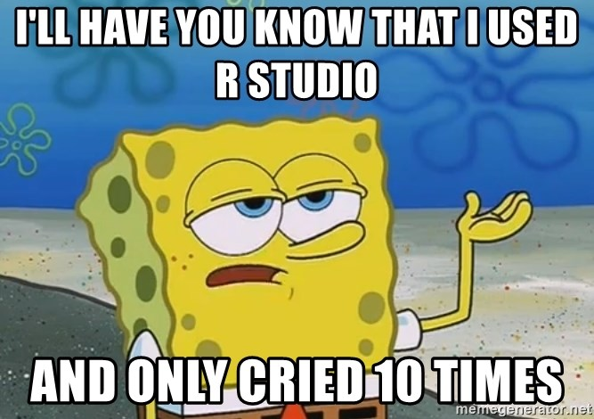
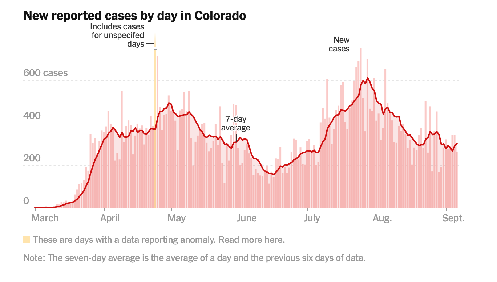

```{r setup, include=FALSE}
# Setup the environment
#install.packages(knitr)
library(knitr)
knitr::opts_chunk$set(fig.align='center',fig.width=10, fig.height=6, fig.path='Figs/',  warning=FALSE, echo=TRUE, eval=TRUE, message=FALSE, cache=FALSE)

r = getOption("repos")
r["CRAN"] = "http://cran.us.r-project.org"
options(repos = r)

```


```{r libraries, include=FALSE}
library(tidyverse)

#install.packages("sf")
library(sf)

#install.packages("smooth")
library(smooth)

#install.packages("tigris")
library(tigris)

#install.packages("tidyquant")
library(tidyquant)
```


Please complete the following questions and submit the finished Rmd and HTML file onto Canvas. In order for this file to *knit*, it needs a file called "lab.css" to be in the same folder as the .Rmd file.

Don't forget to change name field on line 4 to your **first and last name**. 

## Background information 

### R Markdown 

R Markdown is a flexible type of document that allows you to seamlessly combine executable R code, and its output, with text in a single document. These documents can be converted to multiple static and dynamic output formats, including PDF (.pdf), Word (.docx), and HTML (.html). We already have some basic practice in R Markdown from Lab 1. The benefit of a well-prepared R Markdown document is full reproducibility. This also means that, if you notice a data transcription error, or you are able to add more data to your analysis, you will be able to recompile the report without making any changes in the actual document. See [Data Carpentry](https://datacarpentry.org/r-socialsci/05-rmarkdown/index.html#:~:text=R%20Markdown%20is%20a%20flexible,docx)%2C%20and%20HTML%20(.) for some more background on R Markdown and a lot of the different things you can do with it!

Basic components of an R Markdown:

1. Text (this stuff that you're reading right now)

2. R (or other languages) code chunks.
    + Code chunks are delineated by the three back quotes at the top and bottom of the chunk, and the syntax is as follows: 
```{r}
# the hashtag is a comment
print("Here is where you place the code you want to run")
```
  + Below the code chunk is where the output, if there is any, will appear. In the above chunk, I told R to print the phrase "Here is where you place the code you want to run", and it did!

3. Images
    + Images can be embedded by typing the following (without spaces) into a **text area**, not a code chunk:
        + "! [insert caption here] (file path to the image file you want to show)"



4. Equations
    + In text areas, you can have inline equations, such as $E = mc^2$, or centered equations, such as the quadratic formula below.
    + Inline equations are delineated with one dollar sign on each side of the equation, and centered equations are delineated with two dollar signs on each side of the equation. 
    + Equations are write in LaTeX syntax, so if you don't know how to type a function, Google something like "latex square root", and you should get some helpful results. <https://www.overleaf.com/learn/latex/Mathematical_expressions> has some useful resources too!
    
$$ x = \frac{-b \pm \sqrt{b^2-4ac}}{2a} $$
    
5. Plots and figures that you make. 
    + These are related to R code chunks, because if you make a figure in a code chunk it will be an output below the chunk. Below is an example:
    
```{r}
#first I need to create some fake data. We have date values as our x variable, and a normal distribution of random numbers for our y variable. 
x <- seq.Date(from = as.Date("2021/1/1"), to = as.Date("2021/12/31"), by="day")
y <- rnorm(365,mean=300)


ggplot()+
  geom_line(aes(x=x,y=y))+
  xlab("Date")+
  ylab("Distribution")+
  theme_bw()

```
    
<div class="question">

**Q1 (2 pts):** Type your favorite equation in the space provided below. 

**Answer:** $$ E=mc^2 $$ 

</div>


### ggplot2

ggplot2 is a package in R and is a way to explicitly create graphics (figures and plots) based on [The Grammar of Graphics](https://link.springer.com/book/10.1007/0-387-28695-0). You provide the data, tell ggplot2 how to map variables to aesthetics (`aes()`), what graphical primitives to use, and it takes care of the nitty gritty details from there.

ggplot2 works in layers. In most cases you start with `ggplot()`, supply a data set and aesthetic mapping (with `aes()`). You then add on layers (like `geom_point()` or `geom_histogram()`), labels (like `ylab()`), color scales (like `scale_color_brewer()`), faceting specifications (like `facet_wrap()`) and coordinate systems (like `coord_flip()`). See the R ggplot cheatsheet (help tap at the top of the R Studio window, google it, or it's on Canvas.)

The line plot above is a basic example of a ggplot2 figure. Below is a more complicated figure that pulls in data from multiple different sources. 

```{r warning=FALSE, message=FALSE, results='hide'}
# first load in the different data files
# This one is a file of dam locations in the US
dams <- read.csv(file="data/nation.csv", header=T)

# this line filters the data so we only have dams in CO, and gets rid of any NAs

dams <- dams %>%
  filter(State == "Colorado") %>%
  na.omit

# This loads in a shapefile of US counties 
counties <- st_read("data/cb_2018_us_county_20m.shp") 

# Filter it down to just Boulder county
counties <- counties %>%
  filter(STATEFP == '08') %>% #CO
  filter(NAME == 'Boulder')

# load in area water data from the tigris package that interfaces with online USGS data
awater <- area_water("CO","Boulder")
```

```{r warning=FALSE, message=FALSE}
# make the plot by layering on the data
ggplot()+ #make the plotting area
  geom_sf(data=counties,fill="cornsilk",color="grey57")+ #add on the county outlines
  geom_sf(data=awater,aes(fill=AWATER/1e6))+ #add the area of water in sq km
  scale_fill_distiller(palette="Blues",name="Water Surface\nArea (sq km)") + #add color scale for the area water
  geom_point(data=dams, aes(x=Longitude, y=Latitude,color=DamType),size=2)+ #add the point data
  ylim(39.925, 40.26)+ #set the limits of the y-axis
  xlim(-105.7, -105.05)+ # set the limits of the x-axis
  labs(title="Boulder County Lakes, Reservoirs, and Dams by Type")+ #add a title
  theme_bw() #theme black and white because it looks nicer
```

Look it's Boulder county and all of the lakes, reservoirs, and dams!

### Assignment 

The enclosed 'ColoradoCovid.csv' file is the same data set that we used for Lab 1 and contains the basic COVID-19 statistics for the state of Colorado from March 5th - August 8th, 2020.   

The following table is the description of each column:

| Date: | each day of record | 
|-------|--------------------|
|State: |  Colorado |
|death: | Cumulative number of CCOVID-19 related deaths each day|
|deathIncrease: | New confirmed number of COVID-19 related deaths on each day|
|positive:  | Cumulative number of positive COVID-19 cases each day|
|positiveIncrease:  | New confirmed positive COVID-19 cases on each day|
|totalTestResults:  | Cumulative number of tests conducted each day|
|totalTestResultsIncrease:  | Number of new tests on each day|

The goals for the rest of this assignment are to:

1. further explore the capabilities of R and R markdown, 

2. better understand some of the statistical concepts and plots we have learned about in lecture, 

3. and to explore the temporal patterns in this data set. 


```{r}
# Here is the code to load the csv file
# Note, please first check where the file ColoradoCovid.csv file located in your files. You might need to change the path given in the next line. 
covid <- read.csv('data/ColoradoCovid.csv')

#format the date column to be a POSIXct date value 
covid$date <- as.POSIXct(as.character(covid$date), format="%Y%m%d", tz="GMT")

# Clean the data by removing negative values
covid <- covid[covid$positive>=0&covid$positiveIncrease>=0&covid$totalTestResultsIncrease>=0&covid$deathIncrease>=0,]

#look at the first six (6) lines of the data
head(covid)
```


<div class="question">

**Q2 (12 pts):** Using ggplot(), please create two separate histograms, 1) of daily new confirmed positive cases and 2) daily new tests, both with *20 bins*. Please set the bar fill to "blue", color to "black", and label the plot title, x-axis and y-axis in meaningful languages. Hints: `geom_histogram()` is how you add the histogram bars, `labs(x=" ",y=" ",title=" ")` is how you can add your title and axis labels.  

```{r q2, echo=TRUE, eval=TRUE, results=TRUE, message=FALSE}
# Please put your codes of histograms here
ggplot()+

  geom_histogram(data=covid,aes(x=covid$positiveIncrease),color="black",fill="blue", bins=20)+
  
  labs(x="date", y="positiveIncrease",
       title="Distribution of the daily positive cases")+
  theme_bw()

ggplot()+

  geom_histogram(data=covid,aes(x=covid$totalTestResultsIncrease),color="black",fill="blue", bins=20)+

  labs(x="date", y="totalTestResultsIncrease",
       title="Distribution of the daily new tests")+
  theme_bw()
```

</div>


<div class="question">

**Q3 (10 pts):** Based on the histograms you created in **Q2**, please describe what pattern you found for the daily positive cases and daily new tests. For both histograms, answer these questions: are the data unimodal, bimodal, multimodal, or uniform? Are the data skewed? Are there any outliers? Based on the modality and presence (or not) of outliers, should we look at the mean or median of the data to better understand the central tendency? Calculate that measure for both new positive cases and new tests. 

**Answer:** 

```{r q3}
#calculate the mean or median of the new positive cases and new test results here 

#it is bimodal and it is not skewed, also it has outlier. Based on the modality and presence of outliers we sould look at the median of the data to better understand the central tendency.

#positiveIncrease
median(covid$positiveIncrease)
mean(covid$positiveIncrease)
#totalTestResultsIncrease
median(covid$totalTestResultsIncrease)
mean(covid$totalTestResultsIncrease)
```


</div>

<div class="question">

**Q4 (6 pts):** If you identified any outliers in **Q3**, find which dates these outliers occurred on by using `which()` and logical operators to index the rows and columns in the covid dataframe. This is similar to what we did in question 6 of Lab 1! 

```{r q4, echo=TRUE, eval=TRUE, results=TRUE, message=FALSE}
# If there are outliers, please put your R code to identify which dates of these outliers happened here.

covid$date[which(covid$positiveIncrease == 0)]

covid$date[which(covid$totalTestResultsIncrease == 0)]


```

</div>


<div class="question">

**Q5:(12 pts)** Please use ggplot() to create a scatter plot between daily new tests (as x-axis) vs daily new positive cases (as y-axis), and a second scatter plot between daily new cases (as x-axis) vs daily new deaths (as y-axis). For the first plot, please use color="blue" and the second plot use color="red". For both plots, please add a title and label axes using meaningful languages. Hint: `geom_point()` is how you create a scatter plot

```{r q5, echo=TRUE, eval=TRUE, results=TRUE, message=FALSE}
# Please put your code of scatter plots 1) daily new tests vs daily new positive cases here  
library(ggplot2)
ggplot(covid, aes(x=covid$totalTestResultsIncreas, y=covid$positiveIncrease))+
  geom_point(color="blue")
  

# and your code for scatter plot 2) daily new positive cases vs daily new deaths here

ggplot(covid, aes(x=covid$positiveIncrease, y=covid$deathIncrease))+
  geom_point(color="red")
```

</div>


<div class="question">

**Q6:(4 pts)** Based on the plots generated in **Q5**, please describe what relationship you found between the variables.  

**Answer:it seems like there is correlation between daily positive and daily new test because when the daily new test increase daily positive is increase too but for plot2 it seems there is no correlation between daily death and daily positive because while daily positive increase daily death is not.**

</div>


<div class="question">

**Q7:(10 pts)** A commonly used way to visualize the daily COVID-19 cases numbers is to overlay the raw daily cases with a 7 day moving average. See the following figure for an example that New York Times has for Colorado.  Use ggplot() to make a similar type of graph for the Colorado COVID-19 data we have. Try to match the colors of the plot too by exploring R colors <http://www.stat.columbia.edu/~tzheng/files/Rcolor.pdf>. 



Instead of making bars, we'll make lines with different sizes. We can use `geom_line()` and `size=1` for the raw daily new positive cases, and `geom_ma()`, `n=7`, and `size=3`,for the 7-day moving average. Add a relevant title and axis labels, as well as caption below the plot that describes what the plot is showing and an interpretation of any temporal trends you can see.

```{r q7, echo=TRUE, eval=TRUE, results=TRUE}
# put your code to make the plot here
library(ggplot2)
library(tidyquant)
ggplot()+

  geom_line(data=covid, aes(x=date,y=positiveIncrease,title="daily new positive"),size=1,color="rosybrown1")+
  geom_smooth(data=covid,aes(x=date,y=positiveIncrease),color="red",size=2.5,se=FALSE)+
  geom_line(data=covid, aes(x=date,y=death,title="death"),size=1,color="rosybrown2")+
  geom_smooth(data=covid,aes(x=date,y=death),color="brown",size=2.5,se=FALSE)+
  geom_ma(ma_fun=SMA, n = 7, size = 3)+
  labs(x="date", y="cases",
       title="New reported cases by day in Colorado",caption="I thought if positive cases are increased death should be increase together but it's not.")+
    
  theme_bw()
```

</div>


#### 56 points total. 


#### **Reminder** Did you put your name in line 4?


#### Once you're all done with the lab, click the 'knit' button up at the top of this markdown window and submit both the .Rmd and .html files to Canvas. 


### Acknowledgements

This lab is a modified version of many previous labs created by many people. Thanks to Guofeng Cao, Nathalie Chardon, Adam Mahood, Kylen Solvik, Ryan Erickson, Adam Reid, and probably more.
