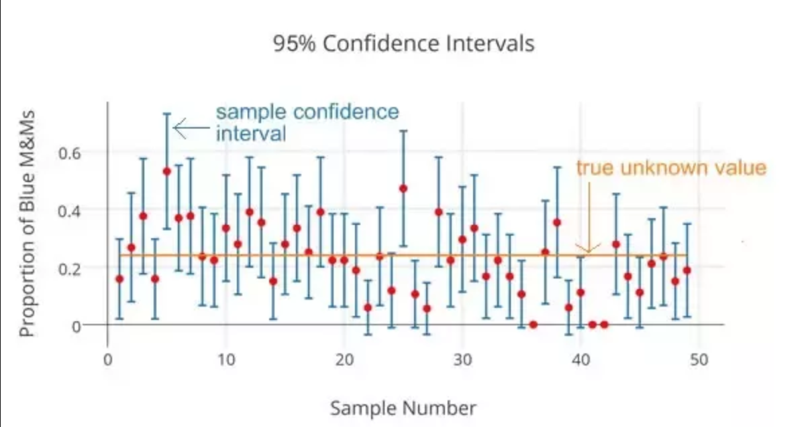

```{r setup, include=FALSE}

# Setup the environment
library(knitr)
knitr::opts_chunk$set(fig.align='center',fig.width=10, fig.height=6, fig.path='Figs/',  warning=FALSE, echo=TRUE, eval=TRUE, message=FALSE)

r = getOption("repos")
r["CRAN"] = "http://cran.us.r-project.org"
options(repos = r)

```

<div class="instructions">

Complete all **10 Questions**, and submit the finished Rmd and knitted HTML file onto Canvas. Don't forget to change name field in the beginning to your first and last name. 

</div>

## Getting Started

### Load (and installing) required packages


```{r load-packages, message=FALSE}
library(tidyverse)
# We need this package for function 'rep_sample_n()', 
# install before use by uncommenting and running the line below
# install.packages('infer')
library(infer)
```


### Introduction

If you have access to data on an entire population, say the area of every house in Ames, Iowa, it's straight forward to answer questions like, "What is the area of a typical house in Ames?" and "How much variation is there in areas of houses?". If you have access to only a sample of the population, as is often the case, the task becomes more complicated. What is your best guess for the typical area if you only know the areas of several dozen houses? This sort of situation requires that you use your sample to make inference on what your population looks like.

### The Data

We'll use real estate data from the city of Ames, Iowa. The details of every real estate transaction in Ames is recorded by the City Assessor's office. Our particular focus for this lab will be all residential home sales in Ames between 2006 and 2010. This collection represents our population of interest. In this lab we would like to learn about these home sales by taking smaller samples from the full population. Let's load the data.

```{r load-data}
ames <- read.csv('data/ames.csv')
```

We see that there are quite a few variables in the data set, enough to do a very in-depth analysis. For this lab, we'll restrict our attention to just two of the variables: 

1. the above ground livable area of the house in square feet (`area`)
2. the sale price (`price`).

We can explore the distribution of areas of homes in the population of home sales visually and with summary statistics. Let's first create a visualization, a histogram:

```{r area-hist}
ggplot(data=ames)+
  geom_histogram(aes(x=area),bins= 50,color="black",fill="azure2")+
  theme_bw()
```

Let's also obtain some summary statistics. Note that we can do this using the`summarise` function. We can calculate as many statistics as we want using thisfunction, and just string along the results. Some of the functions below should be self explanatory (like `mean`, `median`, `sd`, `IQR`, `min`, and `max`). A new function here is the `quantile` function which we can use to calculate values corresponding to specific percentile cutoffs in the distribution. For example `quantile(x, 0.25)` will yield the cutoff value for the 25th percentile (Q1) in the distribution of x. Finding these values are useful for describing the distribution, as we can use them for descriptions like *"the middle 50% of the homes have areas between such and such square feet"*.

```{r area-stats}
ames %>%
  summarise(mu = mean(area), pop_med = median(area), 
            sigma = sd(area), pop_iqr = IQR(area),
            pop_min = min(area), pop_max = max(area),
            pop_q1 = quantile(area, 0.25),  # first quartile, 25th percentile
            pop_q3 = quantile(area, 0.75))  # third quartile, 75th percentile
```


<div class="question">

**Q1 (1 pt):** Which of the following is **false**?

* The distribution of areas of houses in Ames is unimodal and right-skewed. 
* 50\% of houses in Ames are larger than 1,499.69 square feet. 
* The middle 50\% of the houses range between approximately 1,126 square feet and 1,742.7 square feet.
* The IQR is approximately 616.7 square feet. 
* The smallest house is 334 square feet and the largest is 5,642 square feet. 

**Answer:**
* 50\% of houses in Ames are larger than 1,499.69 square feet.

</div>


### Setting a seed

We will take some random samples and calculate confidence based on these samples in this lab, which means you should set a seed on top of your lab. Setting a seed will cause R to sample the same sample each time you knit your document. This will make sure your results don't change each time you knit, and it will also ensure reproducibility of your work (by setting the same seed it will be possible to reproduce your results). You can set a seed like this:

```{r set-seed}
set.seed(9102015) # make sure to change the seed
```

The number above is completely arbitrary. If you need inspiration, you can use your birthday or favorite number. You only need to do this once in your R Markdown document, but make sure it comes before sampling.


## The unknown sampling distribution

In this lab we have access to the entire population, but this is rarely the case in real life. Gathering information on an entire population is often extremely costly or impossible. Because of this, we often take a sample of the population and use that to understand the properties of the population.

If we were interested in estimating the mean living area in Ames based on a sample, we can use the following command to survey the population.

```{r samp1}
samp1 <- ames %>%
  sample_n(size = 50)
```

This command collects a simple random sample of `size` 50 from the `ames` dataset, which is assigned to `samp1`. This is like going into the City Assessor's database and pulling up the files on 50 random home sales. Working with these 50 files would be considerably simpler than working with all 2930 home sales.


<div class="question">

**Q2 (5 pts):** Describe the distribution of this sample. How does it compare to the distribution of the population? **Hint:** `sample_n` function takes a random sample of observations (i.e. rows) from the dataset, you can still refer to the variables in the dataset with the same names. Code you used in the previous exercise will also be helpful for visualizing and summarizing the sample, however be careful to not label values `mu` and `sigma` anymore since these are sample statistics, not population parameters. You should change the labels of the statistics to indicate that these come from the sample.

**Answer:**

```{r samp1-dist}
# type your code for the sample statistics and a histogram here
hist(samp1$area, breaks=50, main="Sample of Home Area in Ames", xlab="Area (Sq Ft)")
samp1 %>%
  summarise(samp1_mean = mean(area), samp1_med = median(area),
            samp1_sd = sd(area), samp1_iqr = IQR(area),
            samp1_min = min(area), samp1_max = max(area),
            samp1_q1 = quantile(area, 0.25),
            samp1_q3 = quantile(area, 0.75))

```

</div>


If we're interested in estimating the average living area in homes in Ames using the sample, our best single guess is the sample mean.

```{r mean-samp1}
samp1 %>%
  summarise(x_bar = mean(area))
```

Depending on which 50 homes you selected, your estimate could be a bit above or a bit below the true population mean of 1,499.69 square feet. In general, though, the sample mean turns out to be a pretty good estimate of the average living area, and we were able to get it by sampling less than 3\% of the population.

Let's take one more sample of size 50, and view the mean area in this sample:

```{r mean-samp2}
ames %>%
  sample_n(size = 50) %>%
  summarise(x_bar = mean(area))
```

Not surprisingly, every time we take another random sample, we get a different sample mean. It's useful to get a sense of just how much variability we should expect when estimating the population mean this way. The distribution of sample means, called the *sampling distribution*, can help us understand this variability. In this lab, because we have access to the population, we can build up the sampling distribution for the sample mean by repeating the above steps many times. Here we will generate 15,000 samples and compute the sample mean of each. Note that we are sampling with replacement, `replace = TRUE` since sampling distributions are constructed with sampling with replacement.

```{r loop}
sample_means50 <- ames %>%
                    rep_sample_n(size = 50, reps = 15000, replace = TRUE) %>%
                    summarise(x_bar = mean(area))
```

Here we use R to take 15,000 samples of size 50 from the population, calculate the mean of each sample, and store each result in a Data Frame called `sample_means50`.


<div class="question">

**Q3 (5 pts):** How many rows are there in `sample_means50` and what does each row represent? Describe the sampling distribution, and be sure to specifically note its center vs. the population mean. Make sure to include a histogram of the distribution in your answer.

**Answer:**

```{r sampling-dist}
# type your code here
#There are 15,000 rows in `sample_means50`. Each row represents the mean of a sample taken from the population. The mean of sample_means50 is extremely close the mean of the overall population.


```

</div>


## Interlude: Sampling distributions

The idea behind the `rep_sample_n` function is *repetition*. Earlier we took a single sample of size `n` (50) from the population of all houses in Ames. With this function we are able to repeat this sampling procedure `rep` times in order to build a distribution of a series of sample statistics, which is called the **sampling distribution**. 

Note that in practice one rarely gets to build sampling distributions, because we rarely have access to data from the entire population. 

Without the `rep_sample_n` function, this would be painful. We would have to manually run and assignment the following code to separate objects *15,000 times*:

```{r sample-code, eval=FALSE}
ames %>%
  sample_n(size = 50) %>%
  summarise(x_bar = mean(area))
```

Note that for each of the 15,000 times we computed a mean, we did so from a **different** sample!


## Sample size and the sampling distribution

The sampling distribution that we computed tells us much about estimating the average living area in homes in Ames. Because the sample mean is an unbiased estimator, the sampling distribution is centered at the true average living area of the population, and the spread of the distribution 
indicates how much variability is induced by sampling only 50 home sales.

In the remainder of this section we will work on getting a sense of the effect that sample size has on our sampling distribution.


<div class="question">

**Q4 (5 pts):** Now we shift the focus on the`price` of the homes. Since you have access to the population, simulate the sampling distribution for $\bar{x}_{price}$ by taking 5000 samples from the population of size 50 and computing 5000 sample means.  Store these means in a vector called `sample_means_price50`. Plot the data, then describe the shape of this sampling distribution. Based on this sampling distribution, what would you guess the mean home price of the population to be?

**Answer:**

```{r price-sampling}
# type your code here
sample_means_price50 <- ames%>%
  rep_sample_n(size = 50, reps = 5000, replace = TRUE) %>%
    summarise(mean_price = mean(price))

hist(sample_means_price50$mean_price, breaks=50, main="Distribution of Sample Mean of Home Price in Ames", xlab="Sample Mean Home Price (USD)")
print(mean(sample_means_price50$mean_price))
# The sample distribution is pretty normally distributed, though a little right-skewed. I would guess the mean home price of the population to be pretty close to $180,000, as the mean of this sample distribution is $180,456.
```

</div>


<div class="question">

**Q5 (5 pts):** Change your sample size from 50 to 150, then compute the sampling distribution using the same method as above, and store these means in a new vector called `sample_means_price150`. Describe the shape of this sampling distribution, and compare it to the sampling distribution for a sample size of 50. Based on this sampling distribution, what would you guess to be the mean sale price of homes in Ames?

**Answer:**

```{r price-sampling-more}
# type your code here
sample_means_price150 <- ames%>%
  rep_sample_n(size = 150, reps = 5000, replace = TRUE) %>%
    summarise(mean_price = mean(price))
hist(sample_means_price150$mean_price, breaks=50, main="Distribution of Sample Mean of Home Price in Ames", xlab="Sample Mean Home Price (USD)")
print(mean(sample_means_price150$mean_price))

#This distribution is even closer to normal than the distribution using only 50 samples, but also very slightly right-skewed. Given that the mean price from this distribution is $180,822, I would expect the population mean to be closer to $180,800 than my previous estimate of $180,000.

```

</div>


<div class="question">

**Q6 (1 pt):** Comparing the sampling distribution from the previous two questions (50 vs 150), which of the following is false? 

* The variability of the sampling distribution with the smaller sample size (`sample_means_price50`) is smaller than the variability of the sampling distribution with the larger sample size (`sample_means_price150`). 
* The means for the two sampling distributions are roughly similar.  
* Both sampling distributions are symmetric. 

**Answer:**
* 

```{r price-sampling-compare}
# type your code here if needed
print(var(sample_means_price150$mean_price))
print(var(sample_means_price50$mean_price))
```

</div>


## Confidence intervals

Return for a moment to the question that first motivated this lab: based on this sample, what can we infer about the population? Based only on this single sample, the best estimate of the average living area of houses sold in Ames would be the sample mean, usually denoted as $\bar{x}$ (here we're calling it `x_bar`). That serves as a good **point estimate** but it would be useful to also communicate how uncertain we are of that estimate. This uncertainty can be quantified using a **confidence interval**.

A confidence interval for a population mean is of the following form:
$$ \bar{x} + t^\star \frac{s}{\sqrt{n}} $$

You should by now be comfortable with calculating the mean and standard deviation of a sample in R. And we know that the sample size is 60. So the only remaining building block is finding the appropriate critical value for a given confidence level. Since we don't know exactly the population standard deviation, we can estimate it with the sample standard deviation. As mentioned in the lecture that we will get the critical values using student's t-distribution. We can use the `qt()` function for this task and since the sample size is 60, the degree of freedom for t-distribution will be 60-1=59. Remember that confidence levels and percentiles are not equivalent. For example, a 95% confidence level refers to the middle 95% of the distribution, and the critical value associated with this area will correspond to the 97.5th percentile.

We can find the critical value for a 95% confidence interval using:

```{r z_star_95}
t_star_95 <- qt(0.975, 59)
t_star_95
```

Let's finally calculate the confidence interval from a random sample of size 60:

```{r ci}
n <- 60

samp <- ames %>% 
  sample_n(60)

samp %>%
  summarise(lower = mean(area) - t_star_95 * (sd(area) / sqrt(n)),
            upper = mean(area) + t_star_95 * (sd(area) / sqrt(n)))
```

To recap: even though we don't know what the full population looks like, we're 95% confident that the true average size of houses in Ames lies between the values *lower* and *upper*. As long as our sample size is greater than 30 or so, it doesn't matter whether the underlying population is normally distributed or not. 


<div class="question">

**Q7 (5 pts):** Calculate a 95% confidence interval from a new random sample of size 250. Is the new confidence interval *narrower* or *wider* than the one with sample size 60? In 1-2 sentences, explain why this confidence interval is narrower or wider (hint: there are two reasons why we would expect the interval to be different). *Note*: You'll have to define a new critical value since your degrees of freedom changed.

**Answer:** 

```{r}
# your code here

tstar_250 <- qt(0.975, 249)
print(tstar_250)
n_250 <- 250
sample_250 <- ames %>%
  sample_n(n_250)
sample_250 %>%
  summarise (lower = mean(area) - tstar_250 * (sd(area) / sqrt(n_250)),
             upper = mean(area) + tstar_250 * (sd(area) / sqrt(n_250))) 


```

</div>


## Confidence levels


<div class="question">

**Q8 (1 pt):** What does "95% confidence" mean when considering the area of houses in Ames, IA?

* 95% of the time the true average area of houses in Ames, Iowa, will be in this interval. 
* 95% of random samples of size 60 will yield confidence intervals that contain the true average area of houses in Ames, Iowa. 
* 95% of the houses in Ames have an area in this interval. 
* 95% confident that the sample mean is in this interval. 

**Answer:**
* 95% of random samples of size 60 will yield confidence intervals that contain the true average area of houses in Ames, Iowa.

</div>


In this case we have the rare luxury of knowing the true population mean since we have data on the entire population. Let's calculate this value so that we can determine if our confidence intervals actually capture it. We'll store it in a data frame called `params` (short for population parameters), and name it `mu`.

```{r pop-mean}
params <- ames %>%
  summarise(mu = mean(area))
```

Using R, we're going to collect many samples to learn more about how sample means and confidence intervals vary from one sample to another.

Here is the rough outline:

-   Obtain a random sample.
-   Calculate the sample's mean and standard deviation, and use these to calculate
and store the lower and upper bounds of the confidence intervals.
-   Repeat these steps 50 times.

We can accomplish this using the `rep_sample_n` function. The following lines of code takes 50 random samples of size `n` from population, and computes the upper and lower bounds of the confidence intervals based on these samples.

```{r calculate-50-cis}
n = 60

t_star_95 <- qt(0.975, df = 59)

ci <- ames %>%
        rep_sample_n(size = n, reps = 50, replace = TRUE) %>%
        summarise(lower = mean(area) - t_star_95 * (sd(area) / sqrt(n)),
                  upper = mean(area) + t_star_95 * (sd(area) / sqrt(n)))
```

Let's view the first five intervals:

```{r first-five-intervals}
ci %>%
  slice(1:5)
```

Next we'll create a figure similar to this one we saw in class:

{width=50%}

First step will be to create a new variable in the `ci` data frame that indicates whether the interval does or does not capture the true population mean. Note that capturing this value would mean the lower bound of the confidence interval is below the value and upper bound of the confidence interval is above the value. Remember that we create new variables using the `mutate` function.

```{r capture-mu}
ci <- ci %>%
  mutate(capture_mu = ifelse(lower < params$mu & upper > params$mu, "yes", "no"))
```

The `ifelse` function takes three arguments: first is a logical statement, second is the value we want if the logical statement yields a true result, and the third is the value we want if the logical statement yields a false result.

We now have all the information we need to create the plot, but we need to re-organize our data a bit for easy plotting. Specifically, we need to organize the data in a new data frame where each row represents one bound, as opposed to one interval. So this:

~~~
     lower    upper capture_mu
1 1350.540 1544.360        yes
2 1333.441 1584.425        yes
3 1412.133 1663.801        yes
...
~~~

should instead look something like:

~~~
  replicate   type     bound capture_mu
1         1  lower  1350.540        yes
2         2  lower  1333.441        yes
3         3  lower  1412.133        yes
4         1  upper  1544.360        yes
5         2  upper  1584.425        yes
6         3  upper  1663.801        yes
...
~~~

We can accomplish this using the following command provided in `tidyr` package:

```{r create-ci-data-for-plot}
ci_data <- gather(ci, type, bound, lower:upper)
```

And finally we can create the plot using the following ggplot command:

```{r plot-ci}
ggplot(data = ci_data, aes(x = bound, y = replicate, 
                           group = replicate, color = capture_mu)) +
  geom_point(size = 2) +  # add points at the ends, size = 2
  geom_line() +           # connect with lines
  geom_vline(xintercept = params$mu, color = "darkgray") # draw vertical line

```


<div class="question">

**Q9 (2 pts)** What proportion of your confidence intervals include the true population mean? Is this proportion exactly equal to the confidence level? If not, explain why.

**Answer:**

```{r find-proportion}
# type your code here
total_capture <- (sum(ci_data$capture_mu == "yes") / 2)
proportion_caught <- (total_capture / (nrow(ci_data) / 2))
print(proportion_caught)

#Only 90% of these confidence intervals contain the true population mean. This is less than the expected 95% of the confidence level, probably because the  sample size of the sampling distribution (50) is quite small. For example, I  cranked this test up 1,000,000 samples (yes, it took a very long time to run), and the resulting capture proportion (94.595%) was much closer to the confidence level of 95%.

```

</div>


<div class="question">

**Q10 (2 pts):** What is the appropriate critical value for a 99% confidence level for t-distribution with 59 degree of freedom? Use `qt()` to find the appropriate value, and remember that `qt()` requires the quantile (percentile) that is related to the given confidence interval.

* 0.01 
* 0.99  
* 1.96 
* 2.20 
* 2.66 

**Answer:**

```{r find-99-perc-crit-val}
# type your code here
n = 60
t_star_99 <- qt(0.995, df = n-1)
print(t_star_99)

```

</div>


#### 32 points total. 


#### **Reminder** Did you put your name in line 4?


#### Once you're all done with the lab, **click the 'knit' button up at the top of this markdown window and submit both the .Rmd and .html files to Canvas**. 

### Acknowledgements

This lab is based on an [OpenIntro](https://www.openintro.org/book/os/#learning_filters) lab.
